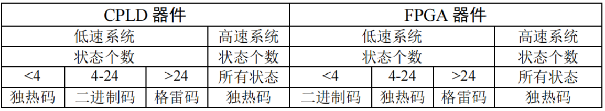
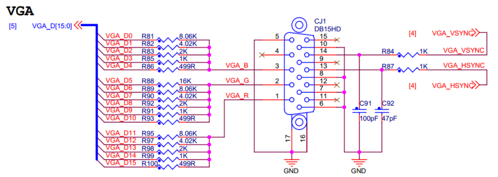
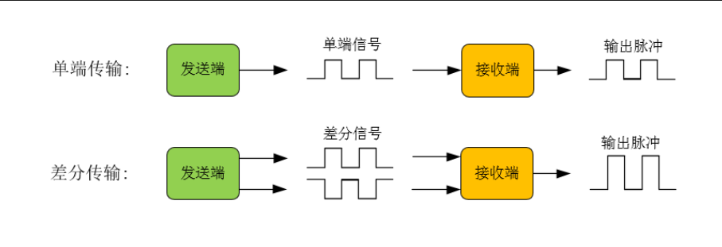

[TOC]

# verilog

## Verilog 语言要素

### 数据类型
数据类型是用来表示数字电路中的物理连线，数据存储和传输单元等物理量。

Verilog中**所有数据类型**都在以下四个值中取值：
- 0 ---- 低电平/逻辑0
- 1 ---- 高电平/逻辑1
- x/X -- 不定或未知的逻辑状态
- z/Z -- 高阻态

::: warning ⚠️ 注意
- 只有0、1、z可综合。
- 只有端口变量可以赋值为z。
:::


| net型                 | variable型 |
| --------------------- | ---------- |
| wire                  | reg        |
| tri                   | integer    |
| ...                   | ...        |
| [Verilog两类数据类型] |            |

#### 线网型
线网型数据相当于**硬件电路的物理连接**，特点是随着输入值的变化而变化。

::: warning ⚠️ 注意
- **线网型值不接受直接的赋值**。
- 未赋值的线网型变量为**高阻态z**（除trireg以外）。
:::

wire型
        wire是最常用的线网型数据变量，一般wire用来定义Verilog模块中的**输入/输出信号**。
多位的wire型变量，也称**wire型向量(Vector)**，可以使用[n-1:0]或[n:1]的方式定义，两种方式的宽度是等价的。

```Verilog
wire a; //定义wire型变量a，宽度为1位
wire [7:0] b; //定义wire型变量b，宽度为8位
wire [8:1] c; //定义wire型变量c，宽度为8位，与上述语句的宽度完全一致
```
tri型（非重点）
       与wire的用法与功能上完全一致，仅仅是为了更清楚表示该信号综合后的电路连线具有三态功能。

#### 寄存器型变量
寄存器型变量必须位于过程语句，通过**赋值语句**赋值。

reg型
     reg是最常用的寄存器型数据变量。多位的reg型变量，也称**reg型向量(Vector)**，可以使用[n-1:0]或[n:1]的方式定义，两种方式的宽度是等价的。

```Verilog
reg a; //定义reg型变量a，宽度为1位
reg [7:0] b; //定义reg型变量b，宽度为8位
reg [8:1] c; //定义reg型变量c，宽度为8位，与上述语句的宽度完全一致
```
::: warning ⚠️ 注意

​     reg变量既可以是寄存器或触发器，也**可以是连线**。综合器会根据实际情况来映射，例如：

```Verilog
module abc(
    input a, b, c, output f1, f2
);
    reg f1, f2;
    always @(a or b or c)
    begin
        f1 = a | b;
        f2 = a & c;
    end
endmodule
上述例子综合完毕后，f1和f2会映射为连线。
```
​        使用[n-1:0]和[n:1]的宽度等价，但其下标使用范围不一致。例如：

```Verilog
reg [8:1] aa;
aa[0] = 1; //❌，因为没有下标为0的位置
```
:::

### 标识符
**标识符由[0-9] [a-z,A-z] '_' '$'组成**。

​       标识符用于定义常数、变量、信号、端口、子模块或参数名称。Verilog语言是区分大小写的，也就是说同一个名称，用大写和用小写就代表了两个不同的符号，这一点与VHDL不同，因此书写的时候要格外注意。
::: tip 提示 💡

- 标识符最长可以包含1023个字符。
- 标识符区分大小写
::: warning ⚠️ 注意
- 标识符的**首字符必须为字母或'_'**。
- 转义标识符以符号'\\'开头，空白符结尾。**可以包含任何字符，可以以任意字符起手**，例如：
```
\7400 
\~#@sel
```
:::

### 整数常量
整数常量的格式按照如下方式书写：
```
+/-<位宽>'<进制><数字>
```
进制的表示方式：
- B/b : 二进制
- D/d : 十进制（默认）
- H/h : 十六进制
- O/o : 八进制

数字不仅可以是[0-9]，还可以是**x/X(不定值)**，**z/Z（高阻态）**。

::: warning ⚠️ 注意
- 位宽表示的是其**二进制宽度**，不应是当前进制下的宽度，需要转换为二进制的形式才能正确表示，在位拓展与位截断上也是以二进制宽度来截取。
```
8'hFF == 8'h000000FF //❌
8'hFF == 8'b11111111 //✔️
```
- 正负号需要写在最左侧，负数通常表示为二进制补码的形式。

- **' 与 进制**之间不允许出现空格，**数值之间**不允许出现空格。
```
8'h2A1B3 //✔️
8  'h2A1B3 //✔️
8'h  2A1B3 //✔️
8  'h  2A1B3 //✔️

8'  h2A1B3 //❌，'与进制之间有空格
8'h2A  1B3 //❌，数值之间有空格
```
- 可以使用'_'划开数字，但本身__无意义。
```
16'b1010110100101001 //✔️
16'b1010_1101_0010_1001 //✔️，且与上面的表示完全等价
```
- 未定义位宽，则默认为**32位**。
```
32'b00000000000000000000000000001101 //✔️
'b1101 //✔️，且与上面的表示完全等价
```
- 位拓展时，一般补0，若最高位为x或z，则补符。
```
10'b0000000010 //✔️
10'b10 //✔️，且与上面的表示完全等价

10'bxxxxxxx0x1 //✔️
10'bx0x1 //✔️，且与上面的表示完全等价
```
- 位截断时，先转换为二进制下的表示形式，然后根据位宽，从最高位向低位截断，如有需要可以再转换为原来的表示形式。
```
5'H0FFF //✔️
5'b0000111111111111 //✔️，且与上面的表示完全等价
5'b11111 //✔️，且与上面的表示完全等价
5'h1F //✔️，且与上面的表示完全等价
```
- x/z在不同进制下表示的宽度不一致，二进制为1位，八进制为3位，十六进制为4位。
```
8'o7x //✔️
8'b00111xxx //✔️，且与上面的表示完全等价

8'haz //✔️
8'b1010zzzz //✔️，且与上面的表示完全等价
```
- 位宽与进制均省略时，**默认为十进制数**。
```
32 //✔️，表示十进制的32
```
- 可以使用s代表带符号的整数
```
8'sh5a //✔️，表示十六进制带符号整数5a
```
:::
### 实数常量
十进制表示法

```
2.0 //✔️
0.123 //✔️

2. //❌，小数点两侧均有数字
.5 //❌，小数点两侧均有数字
```
十进制科学计数法
格式：<数值> e/E <整数数值>

```
4_3_5.1e2 //✔️
435.1e2 //✔️，且与上面的表示完全等价
435.1E2 //✔️，且与上面的表示完全等价
43510.0 //✔️，且与上面的表示完全等价
```
实数转整数的方式：**四舍五入**。
::: tip 提示 💡
负数的四舍五入要向负无穷舍，例如
```
-16.62 --> -17
-25.22 --> -25
```
:::
### 整数变量
格式如下：
```Verilog
integer counter;
counter = -1;
```
### 实数变量
格式如下：
```Verilog
real delta;
delta = 4e10;
delta = 2.13;
```
### 字符串
  字符串必须是双引号内的字符序列，**不可多行书写**。
```
"Hello world!" //✔️

"Hello
 world!" //❌
```
  采用**reg型变量**存储字符串，每个字符是**8位ASCII码**。
  对变量赋值时，如果少于或多余原来设置的reg大小，则发生位截断与位拓展现象。

```Verilog
reg [8*12:1] str;
initial
begin
    str = "Hello World!"; // 实际存储 Hello World!
    str = "Hello!"; // 实际存储 Hello!，在数字进制下高位补0
    str = "Hello Wooooooooooorld!"; // 实际存储 Hello Wooooo
end
```
### 特殊字符
特殊字符 | 说明
:-----------:|:--------------:
\n | 换行符
\t| Tab缩进符
\\\ | 符号反斜杠
\\" | 符号双引号
\ddd（ddd为八进制数） | 表示ddd对应的ASCII字符 

### 参数定义
parameter参数定义

```Verilog
parameter ST1 = 2'b00, ST2 = 2'b01, 
    ST3 = 2'b10, ST4 = 2'b11;
//端口定义
#（
    parameter  A=8'h01，
    parameter  B=8'h02
  ）
//例化
#(
    .A(8'h08)
    .B(8'h09)
 )
```

`define语句定义（重点）

```Verilog
`define ST1 2'b00 //没有分号！！！
`define ST2 2'b01 
`define ST3 2'b10
`define ST4 2'b11
case(state)
    `ST1: //...; //要加撇
    `ST2: //...;
    //... 
endcase
```

localparam语句定义

```Verilog
localparam ST1 = 2'b00, ST2 = 2'b01, 
    ST3 = 2'b10, ST4 = 2'b11;
```
::: tip 提示 💡
- parameter方式：
作用域为**本模块**，可被上层模块重新定义，即**参数传递**。
- `define方式；
作用域为**整个工程**，可跨模块。一般将定义语句放在**模块外**。
- localparam方式：
作用域**局限本模块**，不可参数传递，用于**状态机参数**的定义。
:::

### 位选择和域选择

表达式中可以任选向量中的一位或相邻几位，分别称为位选择和域选择。
域选择时，高位与高位对齐，然后向低位依次赋值。
```Verilog
reg [7:0] a,b; //两个八位寄存器，a[7]和b[7]为最高有效位
reg [3:0] c; //一个四位寄存器，c[3]是最高有效位
reg [0:3] d; //一个四位寄存器，d[0]是最高有效位

A = a[6]; // 位选择
A = a[3:0]; // 域选择

b[5:2] = c;
/*
* 等效于
* b[5] = c[3];
* b[4] = c[2];
* b[3] = c[1];
* b[2] = c[0];
*/
```

### 存储器
存储器是一种**特殊的二位向量**。拥有**单元数和位宽（字长）两个属性**。
存储器的格式如下：

```Verilog
    <数据类型> (<[high1:low1]>) 存储器名 <[high1:low2]>;

    reg [3:0] mymem [63:0];
    // 定义了一个存储器mymem，拥有64个单元，每个单元的位宽为4位。
```
::: warning ⚠️ 注意
只允许对存储的某一个单元进行赋值，例如：

```Verilog
    reg [3:0] mymem [63:0];
    
    mymem[2] = 12; //✔️
    mymem[61] = 8'b10011111; //✔️
```
:::

#### 寄存器与存储器的区别（重点）
中括号在前和在后所表示的含义完全不一致，为了区分，以下举几个常见的例子：
```Verilog
reg [7:0] a1;
//定义了一个8位寄存器a1，最高有效位为a1[7]

reg a2 [7:0];
//定义了一个8个单元的存储器a2，每个单元的位宽为1位
//未指出位宽（字长），默认为1

reg [7:0] a3 [7:0];
//定义了一个8个单元的存储器a2，每个单元的位宽为8位

a1 = 8'b11001100; //✔️,对寄存器a1整体赋值，合法
a1[0] = 1'b1; //✔️，对寄存器a1的第0位赋值，合法

a2[0] = 1'b1; //✔️，对存储器a2的第0个单元赋值，合法
a2 = 8'b11001100;//❌，对存储器a2整体赋值，非法

a3[0] = 1'b1; //✔️，对存储器a3的第0个单元赋值，合法
//数值会经过位拓展，实际存储为8'b00000001

a3[3] = 8'b11001100;//✔️，对存储器a3的第3个单元赋值，合法
```

### 运算符
与C类似，使用运算符对变量和常量之间进行运算，也是Verilog逻辑功能定义的核心。
#### 算数运算符
- \+ 加
- \- 减
- \* 乘
- \\ 除
- % 取余

#### 逻辑运算符
逻辑运算符的结果只有1和0。
- && 逻辑与
- || 逻辑或
- ! 逻辑非
::: warning ⚠️ 注意
参与逻辑运算的数值，**只要有任何一位是非零值，该值整体看为1进行运算**。
:::

#### 位运算符（重点）
- ~ 按位取反
- & 按位与
- | 按位或
- ^ 按位异或
- \^\~/~^ 按位同或

::: warning ⚠️ 注意
- 对于x（不定值）进行位运算时：
0 & x = 0，因为0与任意值与均为0。
1 | x = 1，因为1与任意值或均为1。
0/1 \^\~/~^ x = x，因为异或与同或运算均要参考两边的值。

- 对于位宽不一致的值进行位运算，使短位宽的值进行**位拓展**，例如：
```Verilog
A = 5'b11001;
B = 3'b100;

A | B == 5'11101 //✔️
//等价于5'b11001和5'b00100进行按位或
```
:::

#### 关系运算符
- < 小于
- <= 小于等于
- \> 大于
- \>= 大于等于
::: warning ⚠️ 注意
- 如果任何一边的数值**任意一位存在不定值**，返回值也为不定值。
:::

#### 等式运算符
- == 等于
- != 不等于
- === 全等
- !== 不全等
::: warning ⚠️ 注意
- 对于全等和不全等运算符来说，即使是x（不定值）和z（高阻），也会进行比较，存在以下规则：
```Verilog
x === x //逻辑1
z === z //逻辑1
x === z //逻辑0
x === 1 //逻辑0


a = 5'b11x01;
b = 5'b11x01;

a == b //逻辑0，因为存在x不定值
a === b //逻辑1，因为完全一致
```

:::

#### 归约运算符（缩减运算符）
   将多位宽的数值通过逐位运算缩减为位宽为1的数值。
- & 逐位与
- ~& 逐位与非
- | 逐位或
- ~| 逐位或非
- ^ 逐位异或
- \^\~/~^ 逐位同或

```Verilog
reg [3:0] re;
a = &re 
//等价于 re[3] & re[2] & re[1] & re[0]
b = ~|re
//等价于 ~(~(~(re[3] | re[2]) | re[1]) | re[0])
```

#### 移位运算符
算数移位会保持其数值符号。
- \>> 右移
- << 左移
- \>>> 算数右移
- <<< 算数左移

#### 指数运算符
可以实现 $a^b$ 的效果。
- ** 指数运算符

#### 条件运算符
  满足条件执行第一个语句，否则为第二个语句。
- ? :

#### 位拼接运算符（重点）
  可以简化赋值，也可以使用这种复制法来进行一些巧妙的运算。
```Verilog
input [3:0] ina,inb;
input cin;
output [3:0] sum;
output cout;
assign {cout,sum} = ina + inb + cin;
//ina，inb和cin加起来是4位或5位的数值。
//使用这种办法可以自动切分结果数值
//将[3:0]的部分赋给sum，[4]的部分赋给cout

a = {2{3'b101}};
//等价于
//a = 6'b101101;

b = {3{a,b}};
//等价于
// b = {a,b,a,b,a,b};

wire [7:0] data;
data = 8'b10001111
s_data = {4{data[7]}, data};
//将data的最高位（符号位）复制4次，然后接在data之前，完成位拓展
```

## Verilog 语句语法

### 过程语句
#### initail
常用于仿真初始化，只执行一次。
格式如下：
```Verilog
initail
begin
    //...
end
```
#### always
敏感触发过程块，只要列表中的信号有更新，always下的过程块就会执行，次数不定。
格式如下：
```Verilog
always @(<敏感信号列表>)
begin
    //...
end
```
敏感信号列表的几种表达形式：
```Verilog
always @(a) //当a发生改变时
always @(a or b or c) //当a，b，c任意一个发生改变时
always @(a, b, c) //与上式完全等价，当a，b，c任意一个发生改变时
always @(posedge clock) //当clock上升沿到达时
always @(negedge clock) //当clock下降沿到达时
always @(*) // 所有信号变量，当任意一个发生改变时
```
### 块语句
#### 串行块begin-end
顾名思义，语句依次执行。
一个初始值为0，每隔10个时间单位进行一次翻转的信号sign，一共翻转5次，其串行实现为：
```Verilog
initail
begin
    #0 sign = 0;
    #10 sign = ~sign;
    #10 sign = ~sign;
    #10 sign = ~sign;
    #10 sign = ~sign;
    #10 sign = ~sign;
end
```
#### 并行块fork-join
顾名思义，语句同时并行执行。
一个初始值为0，每隔10个时间单位进行一次翻转的信号sign，一共翻转5次，其并行实现为：
```Verilog
initail
fork
    sign = 0;
    #(10 * 1) sign = ~sign;
    #(10 * 2) sign = ~sign;
    #(10 * 3) sign = ~sign;
    #(10 * 4) sign = ~sign;
    #(10 * 5) sign = ~sign;
join
```
#### 赋值语句
##### 持续赋值语句
assign为持续赋值语句，主要用于对wire型变量的赋值
格式如下：

```Verilog
assign 信号 = <表达式>;
```
#### 条件语句
##### if-else语句
表达式通常为一个逻辑表达式或关系表达式。
::: warning ⚠️ 注意

- 当表达式为非1值（0、x、z）时，均按假，即0值处理。
:::
格式如下：
```Verilog
if(表达式) 语句1; //非完整性if语句，尽量不使用

if(表达式) 语句1; //完整性if语句
else 语句2;

if(表达式) 语句1; //多重选择if语句
else if(表达式) 语句2;
else if(表达式) 语句3;
...
else 语句n;
```
##### case语句(重点)
格式如下：
```Verilog
case (表达式)
    值1 : 语句1;
    值2 : 语句2;
    ...
    default 语句n;
endcase
```
#### 循环语句
##### for循环
格式如下：
```Verilog
for(循环变量初值；循环结束条件；循环变量增值)
    执行语句;
```
::: danger ⭕ 警告
- Verilog不存在i++这样的语法，使用i=i+1这样的语句代替。

##### repeat循环
一种可指定循环的次数循环方式。
格式如下：
```Verilog
repeat(循环次数) 执行语句;
```
##### forever循环
永久循环，一般用来产生周期性波形。
```Verilog
forever 执行语句;
```

### 任务与函数
#### 任务
格式如下：
```Verilog
task <任务名>;
    端口及数据类型声明语句;
    其他语句;
endtask
```
任务调用的格式：
```Verilog
<任务名>(端口1, 端口2, ...)
```
::: warning ⚠️ 注意
- 任务定义与调用必须在同一个module中。
- 任务没有端口名，但紧接着必须进行端口的定义。
- 任务调用的端口名列表必须与任务定义时相一致。
- 任务可以调用任意多的其他任务和函数。
  :::
#### 函数
格式如下：

```Verilog
function <返回值位宽或类型说明> 函数名;
    端口声明;
    局部变量定义;
    其他语句;
endfunction
```

::: warning ⚠️ 注意
- <返回值位宽或类型说明>是可选的，如果缺省，啧返回位宽为1位的寄存器类型数据。
:::
函数调用的格式：
```Verilog
<函数名> (<表达式><表达式>);
```
::: danger ⭕ 警告
- 不允许在函数中启动任务。
- 不允许在函数中有时间控制语句。
:::
### task和function不同点

任务和函数有些不同，主要的不同有以下四点：

（1）函数只能与主模块共用1个仿真时间单位，而任务定义自己的仿真时间单位。
（2）函数不能启动任务，任务可以启动其他任务和函数。
（3）函数至少要有1个输入变量，而任务可以没有或有多个任何类型的变量。
（4）函数返回1个值，而任务不返回值。

## Verilog 仿真

### testbench仿真流程

  编写Testbench 进行测试的过程如下

1. 产生模拟激励（输入波形）
2.  将产生的激励加入到被测试模块并观察其输出响应
3. 将输出响应与期望进行比较，从而判断设计的正确性 

格式如下：

```Verilog
`timescale	1ns/1ps  //时间 / 精度
module mux_tb();
	reg	clk;6    //要在initial块和always块中被赋值的变量一定要是reg型
	wire out;	//输出不用赋值是wire型
  initial begin
      clk=1'd0;
  end
//描述逻辑功能
always	#20	clk=~clk;
mux mux(
    .	clk(clk),
    .	out(out)
);
endmodule
```

### 系统任务与系统函数
\$display与\$write及\$monitor

用于显示模拟的结果，唯一区别是**ㅤ\$display可以自动换行**，而$wirte不行。
monitor是一种特殊的打印，**当输出变量名列表发生改变时，就会输出一次**。
格式如下：

```Verilog
$display("格式控制符", 输出变量名列表);
$write("格式控制符", 输出变量名列表);
$monitor("格式控制符", 输出变量名列表);
```
'timescale

`timescale语句用于定义模块的时间单位和时间精度。
格式如下：

```Verilog
`timescale <时间单位>/<时间精度>;
```
用来表示时间度量的符号有**s、ms、us、ns、ps、fs**。
```Verilog
`timescale 1ns/100ps;
```
上述语句表示延时单位为1ns，延时精度为100ps，即精确到0.1ns。

# 组合逻辑电路

## 定义概念

​    组合逻辑电路在逻辑功能上的特点是==任意时刻的输出==仅仅取决于该时刻的输入，与电路原来的状态无关。

### if else 条件语句

```Verilog
always@(*)
    if     ()
    else if()
    else if()
    else
```

### case 语句

```Verilog
always@(*)
case(sel)
    2'b0:	out=in0;
    2'b1:   out=in1; 
default :	out=in0; 
endcase 
```

### 条件运算符（三目运算符）

```Verilog
assign    out=(sel==2'b0)?in0:(sel==2'b1)?in1:in2;
```

## Latch

### Latch是什么

Latch其实就是锁存器，是一种在异步电路系统中，对输入信号电平敏感的单元，用来存储信息。

### Latch有什么危害

- 锁存器对毛刺敏感，不能异步复位，因此在上电后处于不确定的状态；
- 锁存器会使静态时序分析变得非常复杂，不具备可重用性。，因为FPGA的EDA工具的时序分析是基于时序逻辑分析的，锁存器这种组合逻辑不利于EDA工具进行分析。
- FPGA的基本单元是由查找表和触发组成，如果要生成锁存器，反而需要更多的资源。
- 在ASIC设计中，锁存器也会带来额外的延时和DFT，并不利于提高系统的工作频率，所以要避免产生。

### Latch在什么情况下产生

- 组合逻辑中if语句没有else；
- 组合逻辑中case的条件不能够完全列举时且不写default；
- 组合逻辑中输出变量赋值给自己；

# 时序逻辑电路

## 定义概念

​    时序逻辑电路在逻辑功能上的特点是==任意时刻的输出==不仅取决于当时的输入信号，而且还取决于电路原来的状态。

## D触发器

### D触发器的功能

   触发器当时钟上升沿到来时D触发器将输入端的值传输到输出端

### D触发器的优点

   优点：在两个脉冲边沿，输出状态保持不变，==避免毛刺==现象的产生。

### 同步复位D触发器

   同步复位的D触发器中的“同步”是和工作时钟同步的意思，当时钟的上升沿来到时检测到按复位操作才有效，否则无效。

### 异步复位D触发器

   异步复位的D触发器中的“异步”是和工作时钟不同步的意思，只要有检测到复位操作就立刻执行复位。

## 阻塞赋值和非阻塞赋值

### 阻塞赋值

​    阻塞赋值（=）：赋值语句结束时就==立刻==完成赋值操作，前面的语句没有完成前，后面的语句是不能执行的。在一个过程块内多个阻塞赋值语句是顺序执行的。

### 非阻塞赋值

​    非阻塞赋值（<=）：一条非阻塞赋值语句的执行是不会阻塞下一条语句的执行，非阻塞赋值语句在一个always语句块结束时才完成赋值操作。在一个always语句块内多个非阻塞赋值语句是==并行执行==的。

# 逻辑电路对比

## 定义：

 - 组合逻辑电路在逻辑功能上的特点是任意时刻的输出仅仅取决于该时刻的输入，与电路原来的状态无关。
 - 时序逻辑电路在逻辑功能上的特点是任意时刻的输出不仅取决于当时的输入信号，而且还取决于电路原来的状态，或者说，还与以前的输入有关。

## 代码：

​    时序逻辑的信号敏感列表中有CLK时钟信号，组合逻辑的信号敏感列表是组合逻辑的信号或者是always@(*)

## 电路：

   时序逻辑电路相当于在组合逻辑的基础上添加一个D触发器

## 波形图：

组合逻辑的波形是即刻反应变化的与时钟无关，但是时序逻辑的波形不会立刻反应出来，只有在时钟的上升沿发生变化。

# 分频

## 分频概念定义

  就是把输入信号的频率变成成倍数地低于输入频率的输出信号。

## 降频的概念定义

 当要实现一个N分频的模块，我们可以直接**让计数器cnt计数到N-1**，然后在系统时钟上升沿拉高一个周期的高电平，此时得到的就算降频后的信号

## 分频和降频的区别

  分频调用，直接使用输出信号作为后续模块时钟
```Verilog
//分频调用
always@(posedge clk_out or negedge sys_rst_n)        
        if(sys_rst_n==1'b0)
        a<=1'b0;
        else    a<=a+1'b1;
```

  降频调用，使用系统时钟，当标志信号来临时后续信号才产生变化


```Verilog
always@(posedge sys_clk or negedge sys_rst_n)        
        if(sys_rst_n==1'b0)
        a<=1'b0;
        else    if(clk_flag==1'b1)    
        a<=a+1'b1; 
```

 

## 时钟抖动和时钟偏移

**时钟抖动**（Clock Jitter）：指芯片的某一个给定点上时钟周期发生暂时性变化，使得时钟周期在不同的周期上可能加长或缩短。
**时钟偏移**（Clock Skew）：是由于布线长度及负载不同引起的，导致同一个时钟信号到达相邻两个时序 单元的时间不一致。

  在高速系统设计中，尽量采用降频方式，其中涉及到了**全局时钟树**的概念，降频可以保证更低的**时钟偏移skew**和**抖动jitter**。其中所谓的时钟偏移，指的是从同一时钟源发出的时钟脉冲，通过不同的路径到达每个触发器的时间不同而产生的偏差称为时钟偏移。


# 按键消抖

## 按键消抖原理

  我们所使用的按键开关为机械弹性开关，由于机械触点的弹性作用，闭合或断开的瞬间会有一连串的抖动，为了不产生这种现象而做的措施就是按键消抖

## 硬件消抖

 RS触发器为常用的硬件去抖


## 软件消抖

   根据抖动的时间为5ms~10ms，我们产生一个20ms的延时，让前沿抖动消失后再一次检测键的状态，如果仍保持闭合状态电平，则确认为真正有键按下。

# 状态机

## 什么是状态机

​     有限状态机（Finite-state machine,FSM）,表示有限个状态以及在这些状态之间的转移和动作行为。

## Moore型状态机

​     Moore：最后的输出只和当前的状态有关而与输入无关

## Mealy型状态机

​     Mealy：最后的输出不仅和当前状态有关还和输入有关

## 状态机三段式

​     一段式：一段式指的是在一段状态机中即描述状态转移也描述数据输出

​     二段式：二段式指在第一段状态机中使用描述状态转移，在第二段状态机描述数据输出。

​     三段式：三段式指在一段中描述现态状态转移，在第二段采用==组合逻辑==描述次态状态转移规律，在第三段状态机中描述状态输出

## 状态机编码方式

### 状态编码

常用的编码方式有四种：

#### 顺序编码

即按照**二进制自增**的编码方式。

```Verilog

  parameter IDLE=3'd0;
  parameter	S0=3'd1;
  parameter	S1=3'd2;
  parameter	S2=3'd3;
  parameter	S3=3'd4;
  parameter	S4=3'd5; 
```

#### 格雷编码

由顺序编码，从低位开始**两两异或**取得，最高位向下拉即可。

```Verilog
  parameter	IDLE=3'd001;
  parameter	S0=3'b011;
  parameter	S1=3'b010;
  parameter	S2=3'b110;
  parameter	S3=3'b100;
  parameter	S4=3'b101; 
```

#### 约翰逊编码

最高位取反，左移一次，然后送到最低位。

```Verilog

```

#### 一位热码编码

只有一位1，1的位置向最高位前进。

```Verilog
  parameter	IDLE=6'b000001;
  parameter	S0=6'b000010;
  parameter	S1=6'b000100;
  parameter	S2=6'b001000;
  parameter	S3=6'b010000;
  parameter	S4=6'b100000; 
```

#### 各类编码对比及区别

| 状态 | 顺序编码 | 格雷编码 | 约翰逊编码 | 一位热码编码 |
| -- | -- | 
| state0 | 0000| 0000 | 0000 | 0001|
| state1 | 0001| 0001 | 0001 |0010|
| state2 | 0010| 0011| 0011 | 0100|
| state3 | 0011| 0010 | 0111 | 1000|
[4种编码对比]
::: tip 提示 💡
各类编码的区别如下：

- 顺序编码
  缺点：**瞬变次数多，容易产生毛刺，引发逻辑错误**。
- 格雷编码
  优点：**瞬变次数少，减少毛刺和暂态的可能性**。
- 约翰逊编码
  不知道
- 一位热码编码
  优点：**有效节省和简化译码电路，有效提高电路的速度和可靠性，提高器件资源的利用率**。



# 蜂鸣器

## 有源蜂鸣器

   有源蜂鸣器的内部装有震荡源，不需要音频驱动电路，只需要接通直流电源就能直接发出声响。

## 无源蜂鸣器

  无源蜂鸣器内部不带震荡源，需要使用的PWM方波才能驱动其发声。

   改变频率可以改变无源蜂鸣器的音调
   改变占空比可以改变无源蜂鸣器的音量

# 数码管

   数码管是一种半导体发光器件，其基本单元是发光二极管。数码管按段数一般分为七段数码管和八段数码管，八段数码管比七段数码管多一个发光二极管（多一个小数点显示）。

## HC595

74HC595 是一个 8 位串行输入、并行输出的位移缓存器。其内部具有 8 位移位寄存器和存储器，具有三态输出功能。integer


# IP核

IP核：IP(Intellectual Property)，知识产权，指已经被设计好的模块，可以直接调用这些模块以提高设计效率、减少设计和调试的时间。

## PLL IP核

​      PLL（Phase Locked Loop，即锁相环）可以对输入到FPGA的时钟信号进行任意==分频、倍频、相位调整、占空比调整==，从而输出一个期望时钟。

### PLL工作流程

​        首先需要参考时钟（ref_clk）通过鉴频（FD）鉴相器（PD）和需要输出的时钟频率进行比较，如果参考时钟频率等于需要输出的时钟频率则鉴频鉴相器输出为 0，如果参考时钟频率大于需要输出的时钟频率则鉴频鉴相器输出一个变大的成正比的值，如果参考时钟频率小于需要输出的时钟频率则鉴频鉴相器输出一个变小的正比的值，再通过（LF）环路滤波器，滤掉高频噪声，使之稳定在一个值，再通过（VCO）压控振荡器(环路滤波器输出的电压越大VCO输出的频率越高)输出。

### PLL实现分频

分频：分频器接在参考电压后


### PLL实现倍频

倍频：分频器接在输出时钟和鉴频鉴相器之间

### PLL接口

输入： CLK输入时钟   areset异步复位（高电平有效）

输出：C0 输出时钟    Locked锁定管脚（高电平时钟稳定）


## RAM IP核

​     RAM是随机存取存储器（Random Access Memory），是一个易失性存储器。RAM工作时可以随时从任何一个指定的地址写入或读出数据，同时我们还能修改其存储的数据，写入新的数据。

### 单端口RAM

输入有 输入数据  读使能/写使能 （共用的一个地址线） 时钟（可以使用单时钟或分开的输入输出时钟）     输出数据


### 双端口RAM

#### 简单双端口RAM

 对于简单双端口 RAM，读操作和写操作有专用地址端口 （一个读端口和一个写端口）


#### 真双端口RAM

对于真正双端口 RAM，有两个地址端口用于读写操作（两个读/写端口），即两个端口都可以进行读写。


## ROM IP核

​      ROM是只读存储器（Read-Only Memory），是一种==只能读出事先所存数据==的固态半导体存储器。其特性是一旦储存资料就无法再将之改变或删除，且资料不会因为电源关闭而消失。用IP 核生成的ROM 模块只是提前添加了数据文件（.mif 或.hex 格式）

###      单端口ROM

​          对于单端口ROM  输入有读地址端口，时钟（可以使用单时钟或分开的输入输出时钟）可以添加读使能信号）

​                                       输出有一个读数据端口 只能进行读操作。


### 双端口ROM

双端口ROM与单端口ROM类似，区别是提供两个读地址端口和两个读数据端口，基本上可以看做两个单口RAM拼接而成。


### MIF文件格式

mif(Memory Initialization File)

设置位宽，深度，地址格式，数据格式，开始 地址：数据 结束

```verilog
WIDTH=8;//位宽
DEPTH=1024;//深度
ADDRESS_RADIX=UNS;  //unsigned 无符号数   地址格式
DATA_RADIX=HEX; //Hexadecimal 十六进制    数据格式
CONTENT BEGIN
0  :  00  ;
1  :  00  ;
[2..1023]  :   00;
END;
```


## FIFO IP核

​       FIFO（First In First Out，先入先出），是一种数据缓冲器，用来实现数据==先入先出==的读写方式。FIFO没有地址线，只能遵循先进先出的规则来读

FIFO根据读写时钟的不同可以分为SCFIFO（同步FIFO，即读写时钟相同）和DCFIFO（异步FIFO，即读写时钟不同）


### 同步FIFO

SCFIFO的输入有：clk、data（写入的数据）、wrreq（写请求）、rdreq（读请求）；
​                 输出有：empty（空状态）、full（满状态）、usedw（读写用量，表示当前还有几个数据）、q（读出的数据）；


### 异步FIFO

DCFIFO的输入有：wrclk（写时钟）、rdclk（读时钟）、data（写入的数据）、wrreq（写请求）、rdreq（读请求）；
​                 输出有：wrempty（写空状态）、wrfull（写满状态）、rdempty（读空状态）、rdfull（读满状态）、wrusedw（写用量）、rdusedw（读用量）、q（读出的数据）。


# VGA

## VGA简介

​        图像显示设备在日常生活中随处可见，例如家庭电视机、计算机显示屏幕等，这些设备之所以能够显示我们需要的数据图像信息，归功于视频传输接口。常见的视频传输接口有三种： VGA 接口、 DVI 接口和 HDMI 接口，目前的显示设备都配有这三种视频传输接口。  
​        三类视频接口的发展历程为 VGA→DVI→HDMI。其中 VGA 接口出现最早，只能传输模拟图像信号； 随后出现的 DVI 接口又分为三类： DVI-A、 DVI-D、 DVI-I，分别可传输纯模拟图像信号、纯数字图像信号和兼容模拟、数字图像信号；最后的 HDMI 在传输数字图像信号的基础上又可以传输音频信号。  

​        VGA，英文全称“Video Graphics Array” ，译为视频图形阵列，是一种使用模拟信号进行视频传输的标准协议，由 IBM 公司于 1987 年推出，因其分辨率高、显示速度快、颜色丰富等优点，广泛应用于彩色显示器领域。 

## VGA接口及引脚定义

​         在最初的应用中， VGA 接口常用于计算机与 VGA 显示器之间的图像传输，在台式计算机、旧式笔记本电脑和 VGA 显示器上一般会有标准的 VGA 接口。 


​       由图可知， VGA 接口共有 15 个引脚，分为 3 排，每排各 5 个， 按照自上而下、从左向右的顺序排列。 其中第一排的引脚 1、 2、 3 和第三排的引脚 13、 14 最为重要。  
VGA 使用工业界通用的 RGB 色彩模式作为色彩显示标准，这种色彩显示标准是根据三原色中红色、绿色、蓝色所占比例多少及三原色之间的相互叠加得到各式各样的颜色。==引脚 1 红基色(RED)、引脚 2 绿基色(GREEN)、引脚 3 蓝基(BLUE)==就是 VGA 接口中负责传输三原色的传输通道。要注意的是，这 3 个引脚传输的是模拟信号。  
引脚 ==13 行同步信号(HSYNC)==、引脚 ==14 场同步信号(VSYNC)==，这两个信号，是在 VGA显示图像时，负责同步图像色彩信息的同步信号。  

​      引脚 5、9：这两个引脚分别是 VGA 接口的自测试和预留接口，不过不同生产厂家对这两个接口定义不同，在接线时，两引脚可悬空不接。  引脚 4、 11、 12、 15：这四个是 VGA 接口的地址码，可以悬空不接。引脚 6、 7、 8、 10：这四个引脚接地，无需解释。 

## VGA显示原理

​        VGA 显示器显示图像，采用扫描的方式，将构成图像的像素点，在行同步信号和场同步信号的同步下，按照从上到下、 由左到右的顺序扫描到显示屏上。 VGA 显示器扫描方式，具体见下图。


​        在扫描的过程中会对每一个像素点进行单独赋值，使每个像素点显示对应色彩信息，  
当一帧图像扫描结束后， 开始下一帧图像的扫描，循环往复，当扫描速度足够快，加之人眼的视觉暂留特性，我们会看到一幅完整的图片，而不是一个个闪烁的像素点。这就是VGA 显示的原理。

## VGA 时序 

VGA 时序由两部分构成，行同步时序与场同步时序

### **VGA行时序**

​    行同步信号时序分为 6 段， Sync（同步） 、 Back Porch（后沿） 、 Left Border（左边框） 、 “Addressable” Video（有效图像）、 Right Border（右边框）、 Front Porch（前沿） ，这 6 段构成一个行扫描周期，单位为像素时钟周期。


### **VGA场时序**

​      场同步信号时序分为 6 段， Sync（同步） 、 Back Porch（后沿） 、 Top Border（左边框） 、 “Addressable” Video（有效图像）、 Bottom Border（底边框）、 Front Porch（前沿） ，这 6 段构成一个行扫描周期，单位为像素时钟周期。


## VGA显示模式以及相关参数

​       行同步时序可分为 6 个阶段，对于这 6 个阶段的参数是有严格定义的，参数配置不正确， VGA 不能正常显示。 VGA 显示器可支持多种分辨率，不同分辨率对应个阶段的参数是不同的，常用 VGA 分辨率时序参数，具体见图。


下面我们以经典 VGA 显示模式 640x480@60 为例，为讲解一下 VGA 显示的相关参数 

#### 显示模式 

​             640x480 是指 VGA 的分辨率， 640 是指有效显示图像每一行有 640 个像素点， 480 是指每一帧图像有 480 行， 640 * 480 = 307200 ≈ 300000，每一帧图片包含约 30 万个像素点，之前某品牌手机广告上所说的 30 万像素指的就是这个； @60 是指 VGA 显示图像的刷新频率， 60 就是指 VGA 显示器每秒刷新图像 60 次，即每秒钟需要显示 60 帧图像。

#### VGA 时钟

 VGA 显示的工作时钟，像素点扫描频率。

 **时钟频率**==**行扫描周期** ***** **场扫描周期** ***** **刷新频率** 

800 * 525 * 60 = 25,200,000 ≈ 25.175MHz （误差忽略不计） 

::: tip 提示 💡
        在计算时钟频率时，读者要谨记一点，要使用行扫描周期和场扫描周期的参数进行计算，不能使用有效图像的参数进行计算，虽然在有效图像外的其他阶段图像信息均无效，但图像无效阶段的扫描也花费了扫描时间。 

## VGA电路开发板原理图分析

​          VGA 只能识别模拟信号，而 FPGA 输出的图像信息为数字信号，在 VGA 的图像显示中，想要将数字图像信号转换为 VGA 能够识别的模拟信号有两种方法。其一，使用专业的转换芯片，如常用的转换芯片 AD7123，这种方式更为稳定，但成本稍高；其二，使用权电阻网络实现数模转换，这种方式可以有效降低成本



​          由图可知，征途 Pro 使用的 RGB565 图像模式，位宽为 16bit，高 5 位表示红色，低 5 位表示蓝色，中间 6 位表示绿色。根据位宽不同，RGB 图形格式还包括 RGB232、RGB888 等，数据位宽越大，表示颜色种类越多，显示图像越细腻。 VGA_D[15:0]表示 FPGA 传入权电阻网络的数字图像信号，经过权电阻网络的数模转换，生成能够被 VGA 识别的模拟图像信号 VGA_R、VGA_G、VGA_B。 这三路模拟信号的电压范围为 0V ~ 0.714V，0V 代表无色，0.714V 代表满色，电压高 低由输入的数字信号决定。输入的 R、G、B 数字信号不同，输出的三原色红、绿、蓝电压不同，颜色深浅不同，三原色相结合可以产生多种颜色

# 串口

​         通用异步收发传输器（Universal Asynchronous Receiver/Transmitter），通常称作UART。UART 是一种通用的数据通信协议，也是异步串行通信口（串口）的总称，它在发送数据时将并行数据转换成串行数据来传输，在接收数据时将接收到的串行数据转换成并行数据。它包括了 RS232、RS485、RS423、RS422 和 RS499 等接口标准规范和总线标准规范

UART 通信只有两根信号线，一根是发送数据端口线叫 tx（Transmitter），一根是接收数据端口线叫 rx（Receiver）UART 可以实现全双工，即可以同时进行发送数据和接收数据


## RS232通讯协议

### 通讯原理

​            RS232是UART的一种，没有时钟线，只有两根数据线，分别是rx和tx，这两根线都是1bit位宽的。其中rx是接收数据的线，tx是发送数据的线。

​            串口数据的发送与接收是基于帧结构的，即一帧一帧的发送与接收数据。每一帧除了中间包含 8bit 有效数据外，还在每一帧的开头都必须有一个起始位，且固定为 0；在每一帧的结束时也必须有一个停止位，且固定为 1，即最基本的帧结构（不包括校验等）有10bit。在不发送或者不接收数据的情况下，rx 和 tx 处于空闲状态，此时 rx 和 tx 线都保持高电平，如果有数据帧传输时，首先会有一个起始位，然后是 8bit 的数据位，接着有 1bit的停止位，然后 rx 和 tx 继续进入空闲状态，然后等待下一次的数据传输。

UART 可以实现全双工，即可以同时进行发送数据和接收数据。


### 波特率

波特率：在信息传输通道中，携带数据信息的信号单元叫码元（因为串口是 1bit 进行传输的，所以其码元就是代表一个二进制数），==每秒钟通过信号传输的码元数称为码元的传输速率，简称波率==，常用符号“Baud”表示，其单位为“波特”。串口常见的波特率有 4800、9600、115200 等

### 比特率

比特率：==每秒钟通信信道传输的信息量称为位传输速率，简称比特率==，其单位为“每秒比特数（bps）”。比特率可由波特率计算得出，公式为：==比特率=波特率 * 单个调制状态对应的二进制位数==。如果使用的是 9600 的波特率，其串口的比特率为：
​                                                             9600Bps * 1bit= 9600bps

​    由计算得串口发送或者接收 1bit 数据的时间为一个波特，即 1/9600 秒，如果用50MHz（周期为 20ns）的系统时钟来计数，需要计数的个数为 cnt = (1s * 10^9)ns / 9600bit)ns / 20ns ≈ 5208 个系统时钟周期，即每个 bit 数据之间的间隔要在 50MHz 的时钟频率下计数 5208 次。

## RS485通讯协议

### 通讯原理

​     RS-485 是双向、半双工通信协议，RS-485 采用差分传输方式，允许多个驱动器和接收器挂接在总线上，其中每个驱动器都能够脱离总线。

###    什么是半双工

   半双工就是指数据可以在一个信号载体的两个方向上传输，但是不能同时传输。

###   什么是差分传输

​    单端传输是指在传输过程中，在一根导线上传输对地之间的电平差，用这个电平差值来表示逻辑“0”和“1”（RS232 即为单端传输方式）。而差分传输是使用两根线进行传输信号，这两根线上的信号振幅相等，相位相差 180 度，极性相反。在这两根线上传输的信号就是差分信号，信号接收端比较这两个信号电压的差值来判断发送端发送的逻辑“0”和逻辑“1”。单端传输和差分传输如下图 所示。

​         单端传输发送什么信号就输出什么信号，而差分传输则是输出发送端信号的差值。当有共模干（两导线上的干扰电流振幅相等，频率、相位、方向相同）时，==差分传输就能有效的抑制干扰==，而单端传输却不能




# 项目

## B码

​    IRIG-B码是时间系统中的一种常用串行传输方式，对比并行传输方式其连续简单、传输距离远，接口标准化，国际通用。IRIG-B码又包括两种方式：B（DC）码和B（AC）码，（DC为数字信号，AC为模拟调制过的正弦信号）B（AC）码可以使用标准语音带宽（0.3kHZ--3.4KHZ）信道传输，传输距离更远，传输精度有一定的损失。

B码信号是每秒一帧的时间串码,一帧串码中包含100个码元，频率为1kHz，故每个码元占用10ms时间

## GPS

比如：$GNRMC,143147.000,A,3413.64266,N,10851.97266,E,000.8,296.4,170821,,,A*7C
　　这一帧数据里面就包含了经纬度，比如这帧数据里面，“3413.64266”这个数是34度加13.64266分，分到度是60进制，因此要把分转换成度需要把分除以60，意思是13.64266分等于13.64266 / 60 = 0.227378度，那么3413.64266这个数就是34.227378度。同理经度也是一样。


# verilog常用模块设计


# VSCODE 插件

1、CodeGeex

2、Copilot

3、vscode-icons

4、Verilog-HDL/SystemVerilog/Bluespec SystemVerilog

5、Verilog Snippet

6、TerosHDL

7、TabOut

8、Rainbow Brackets 2（彩虹括号）

9、Prettier - Code formatter

10、Power Mode 连击

11、One Dark Pro

12、Material Icon Theme

13、Local History

14、indent-rainbow

15、Increment Selection

16、Git History

17、Git Graph

18、CodeSnap

19、Code Translate

20、Better Comments

21、background-cover


